# RCS-MoE

Official implementation, figures, and experimental results for **RCS-MoE: Rare-Class-Aware Edge-Cloud Intrusion Detection for IoT Networks**.

RCS-MoE is a rarity-conditioned selective mixture-of-experts model for multiclass IoT intrusion detection. The implementation includes semantic feature-group tokenization, rarity-conditioned attention, sparse specialist experts, edge/specialist/cloud routing, family supervision, reconstruction loss, calibration analysis, and cost-aware inference.


## Requirements

Recommended configuration:

- Python 3.10 or 3.11
- Windows 10/11 or Linux
- CUDA-capable GPU recommended for full journal experiments
- At least 16 GB RAM
- Sufficient storage for CICIoT2023 CSV files, checkpoints, tables, predictions, and figures

Python packages used by the main pipeline:

```text
numpy
pandas
scipy
scikit-learn
matplotlib
openpyxl
joblib
psutil
torch
xgboost
```

## Create the environment

### Conda

```bash
conda create -n care-iot python=3.10 -y
conda activate care-iot
```

Install PyTorch using the command appropriate for your CUDA version from the official PyTorch installer. For a CPU-only environment:

```bash
pip install torch torchvision torchaudio
```

Install the remaining dependencies:

```bash
pip install numpy pandas scipy scikit-learn matplotlib openpyxl joblib psutil xgboost
```

Confirm the installation:

```bash
python -c "import torch, pandas, sklearn, xgboost; print('PyTorch:', torch.__version__); print('CUDA available:', torch.cuda.is_available())"
```

## Dataset preparation

The main script expects CICIoT2023 CSV files in the following structure:

```text
D:\other\CARE-IoT\
└── Datasets\
    └── CICIOT23\
        ├── train\
        │   └── train.csv
        ├── validation\
        │   └── validation.csv
        └── test\
            └── test.csv
```

The default configuration appears near the top of `Code/careiot_rcsmoe.py`:

```python
ROOT = Path(r"D:\other\CARE-IoT")
DATA_DIR = ROOT / "Datasets" / "CICIOT23"

TRAIN_PATH = DATA_DIR / "train" / "train.csv"
VAL_PATH = DATA_DIR / "validation" / "validation.csv"
TEST_PATH = DATA_DIR / "test" / "test.csv"
```

Change `ROOT` before running the code when your project is stored elsewhere.

Linux example:

```python
ROOT = Path("/home/user/CARE-IoT")
```

The script creates and reuses fixed stratified subsets with data-split seed 42:

```text
Datasets/CICIOT23_FIXED_20_10_10/
├── train_20pct_seed42.csv
├── validation_10pct_seed42.csv
├── test_10pct_seed42.csv
└── split_metadata.json
```

The configured fractions are 20% of the source training file, 10% of validation, and 10% of test. All methods and model seeds reuse the same sampled rows.

## Run the complete RCS-MoE experiment

Open a terminal in the repository root.

### Windows Command Prompt

```bat
conda activate care-iot
cd /d D:\path\to\RCS-MoE\Code
python careiot_rcsmoe.py
```

### PowerShell

```powershell
conda activate care-iot
Set-Location "D:\path\to\RCS-MoE\Code"
python .\careiot_rcsmoe.py
```

### Linux

```bash
conda activate care-iot
cd /path/to/RCS-MoE/Code
python careiot_rcsmoe.py
```

The script automatically uses CUDA when available:

```python
DEVICE = torch.device("cuda" if torch.cuda.is_available() else "cpu")
```

## Full run and smoke test

The main configuration includes:

```python
JOURNAL_MODE = True
```

Use the full setting for paper experiments:

```python
JOURNAL_MODE = True
```

Use a smoke test to verify paths, dependencies, data loading, and output generation:

```python
JOURNAL_MODE = False
```

The default model configuration is:

```text
Model seeds: 11, 22, 33, 44, 55
Full-model epochs: 8
Ablation epochs: 6
Batch size: 4096
Latent dimension: 48
Attention heads: 4
Transformer layers: 2
Experts: 6
Selected experts: 2
Rare-class threshold: 1000
Figure resolution: 600 DPI
```

Reduce `BATCH_SIZE` if GPU or system memory is insufficient.

## Run the edge-oriented script

```bash
cd Code
python careiot_rcsmoe_edge.py
```

Use this entry point for the edge-focused implementation and measurements. Review the path and configuration constants at the top of the file before execution.

## Run analysis from trained outputs

```bash
cd Code
python careiot_rcsmoe_pretrained_analysis.py
```

Run this script after training when checkpoints and result files already exist. Confirm that its model and result directories match the paths produced by the training pipeline.

## Output directories

The default pipeline writes artifacts to:

```text
D:\other\CARE-IoT\Models\RCSMOE_JOURNAL
D:\other\CARE-IoT\Results\RCSMOE_JOURNAL
```

Generated result subdirectories include:

```text
RCSMOE_JOURNAL/
├── tables/
├── figures/
├── predictions/
└── logs/
```

Tables are written in CSV, Excel, and LaTeX-compatible formats where supported. The pipeline also saves trained models, preprocessing objects, predictions, logs, and publication figures.

## Implemented experiments

The main script evaluates:

- Complete RCS-MoE
- RCS-MoE without rarity conditioning
- RCS-MoE without sparse experts
- RCS-MoE without the cost objective
- RCS-MoE without the family objective
- RCS-MoE without reconstruction
- Fixed edge-only inference
- Fixed cloud-only inference
- Random Forest
- XGBoost, when installed

The pipeline reports classification, rare-class, family-level, calibration, routing, latency, expert-utilization, reconstruction, and cost-sensitivity results.

## Figures

### Multi-seed macro F1

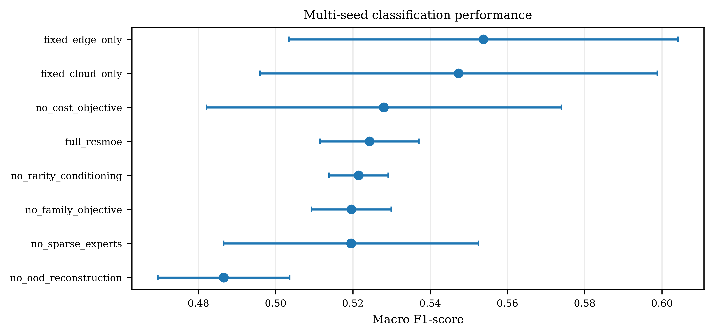

### Ablation deltas

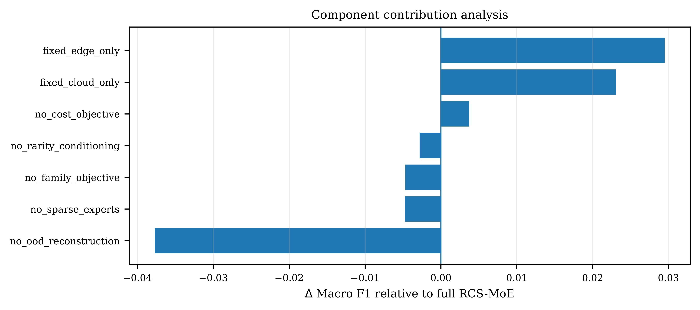

### Reliability analysis

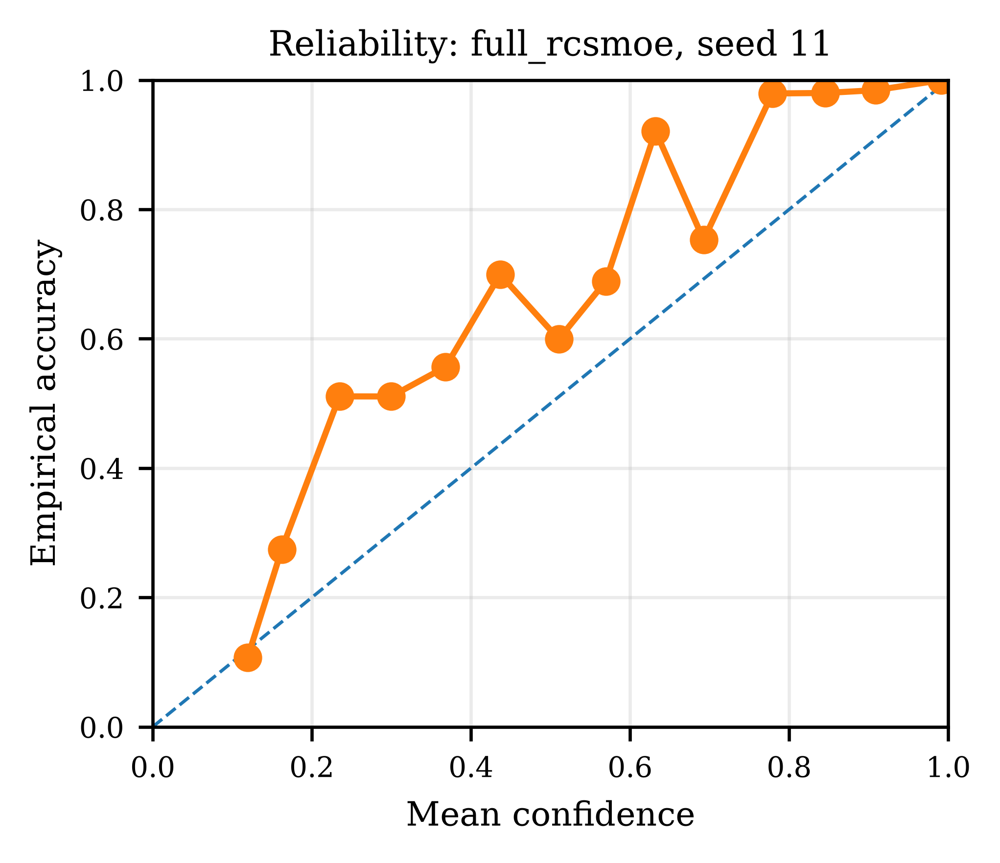

### Confidence analysis

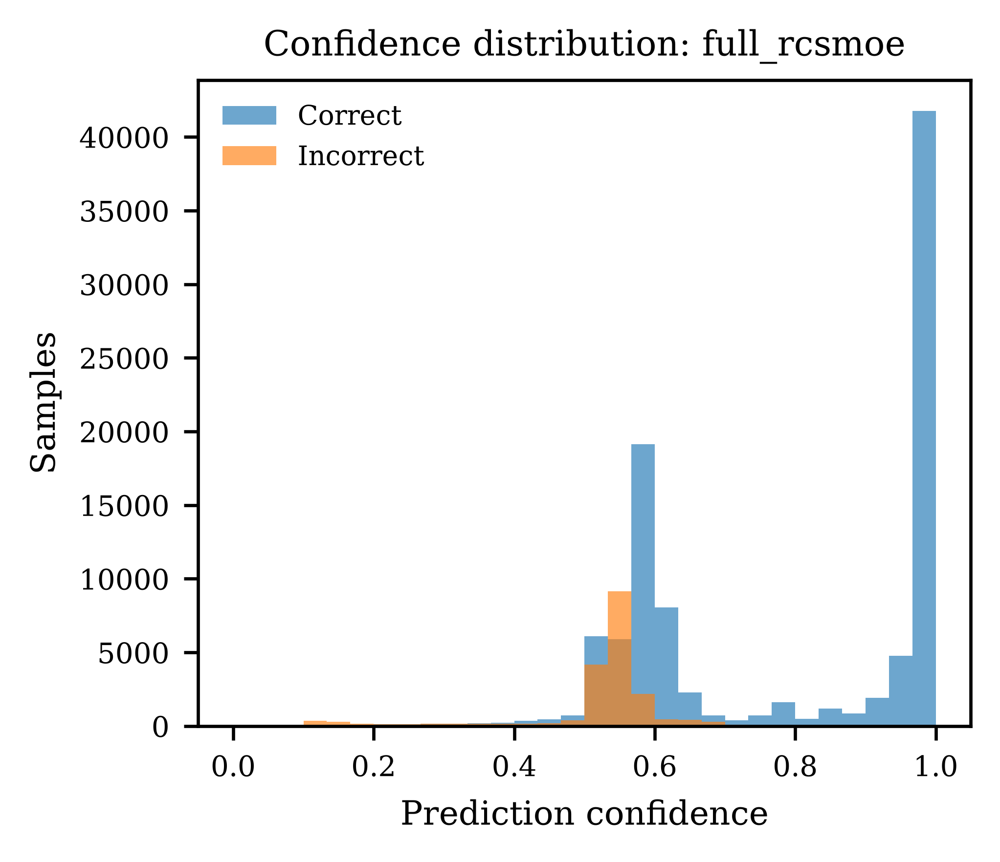

### Per-class F1 for all classes

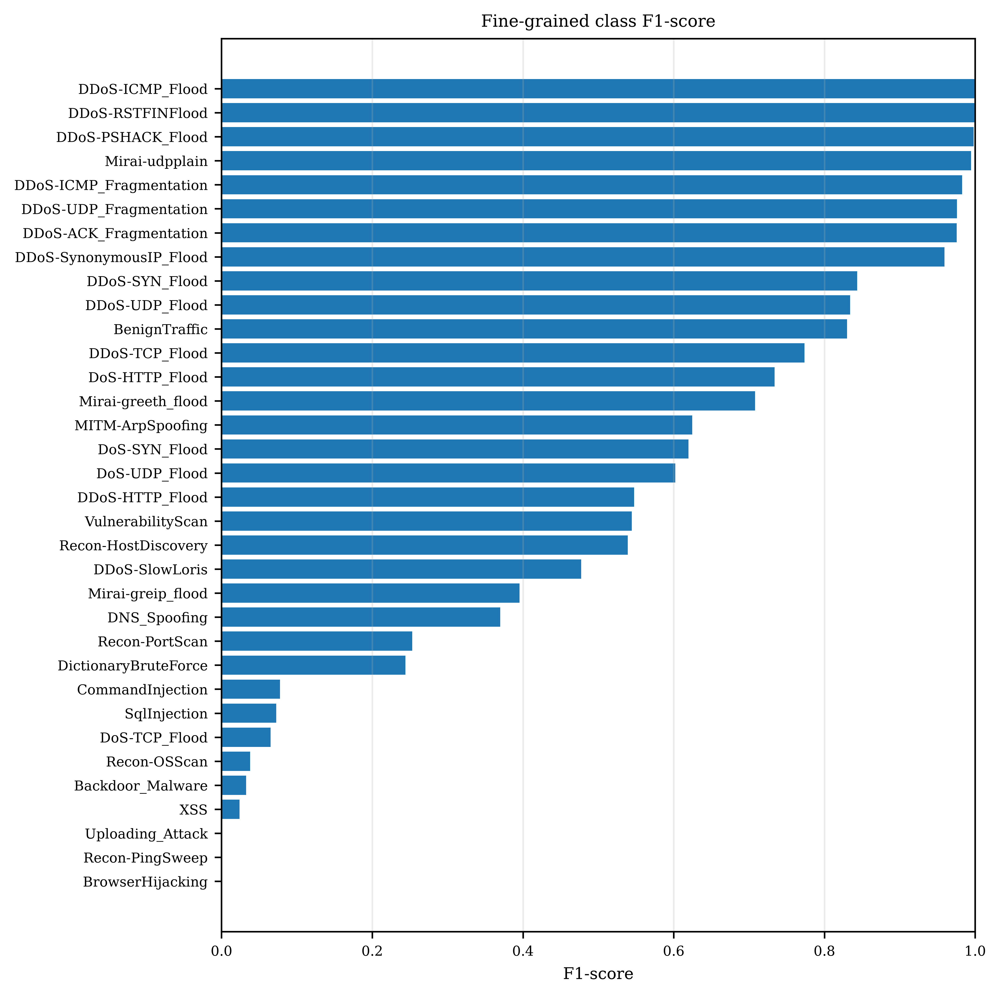

### Per-class F1 for rare classes

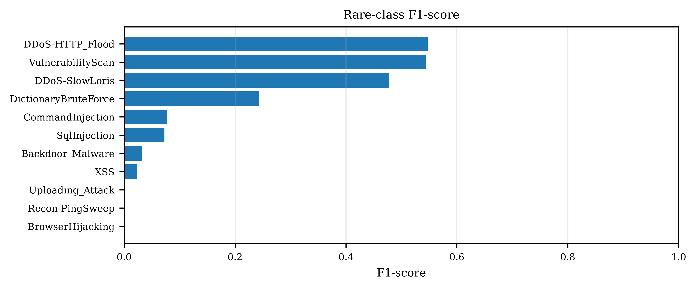

### Family routing

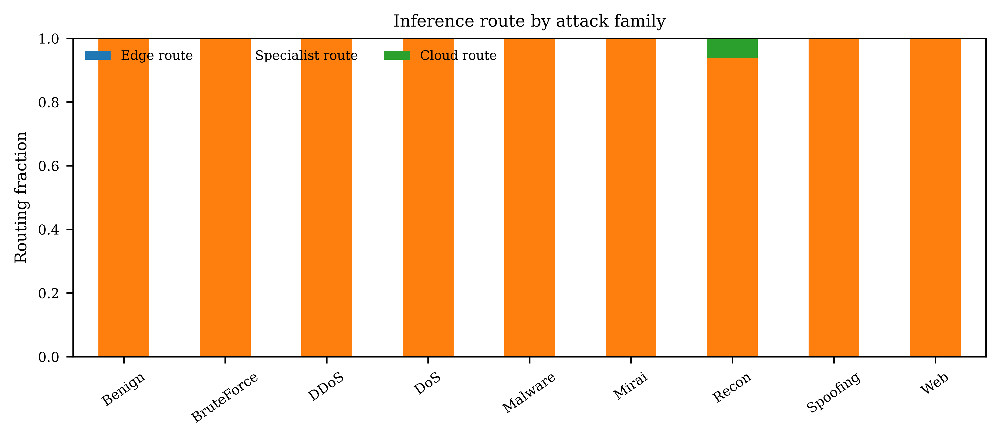

### Expert specialization

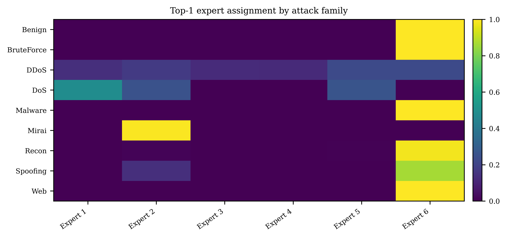

### Layer-wise feature attention

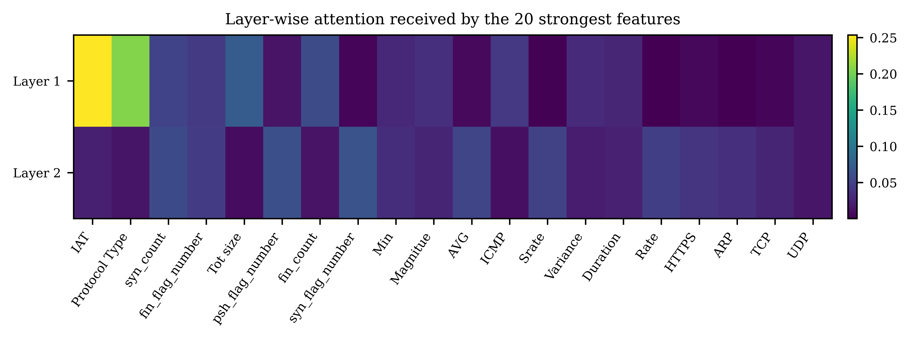

### Reconstruction analysis

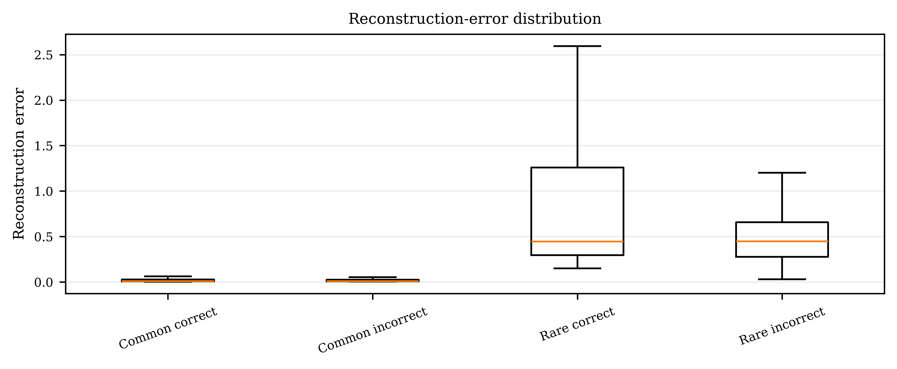

### Cost-accuracy tradeoff

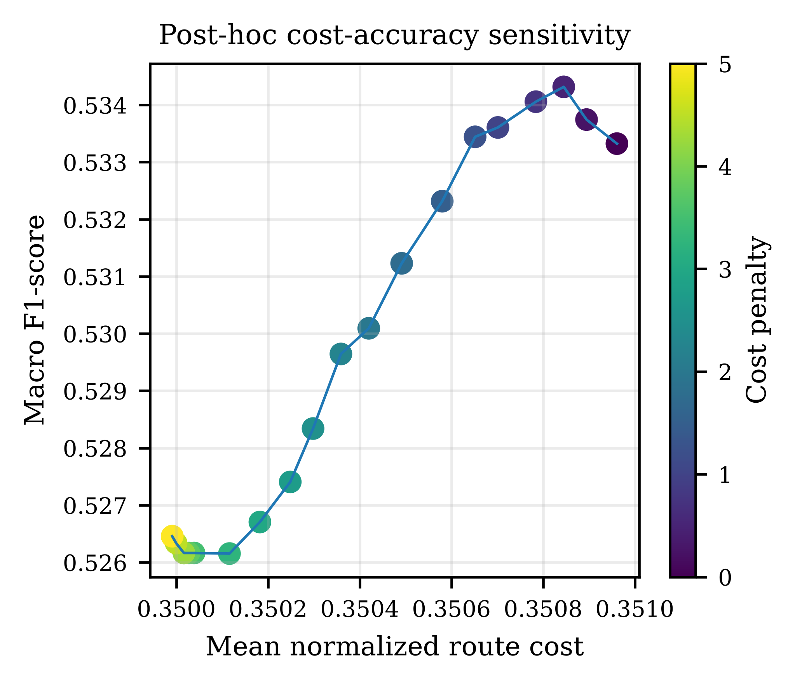

### Embedding PCA

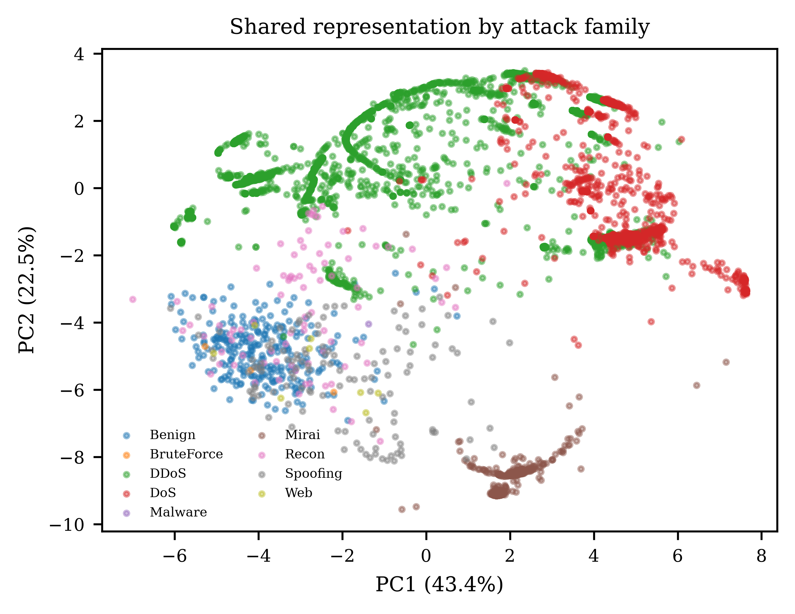

## Reproducibility

The implementation separates the data split seed from model initialization seeds.

```python
DATA_SPLIT_SEED = 42
MODEL_SEEDS = [11, 22, 33, 44, 55]
```

The script also configures deterministic PyTorch behavior:

```python
torch.backends.cudnn.deterministic = True
torch.backends.cudnn.benchmark = False
```

GPU operations and third-party libraries can still introduce small platform-dependent differences. Record your Python, CUDA, PyTorch, scikit-learn, and XGBoost versions when reproducing the experiments.

## Common problems

### `FileNotFoundError`

Check `ROOT`, `TRAIN_PATH`, `VAL_PATH`, and `TEST_PATH` in the script. Confirm that each CSV exists at the configured location.

### CUDA out-of-memory error

Reduce:

```python
BATCH_SIZE = 4096
```

For example:

```python
BATCH_SIZE = 1024
```

You may also run on CPU, although the full experiment will take longer.

### XGBoost is skipped

Install it:

```bash
pip install xgboost
```

The code detects XGBoost automatically and disables that baseline if the package cannot be imported.

### Excel output fails

Install the Excel writer dependency:

```bash
pip install openpyxl
```

### Multiprocessing issue on Windows

Keep:

```python
NUM_WORKERS = 0
```

This is the default configuration.

### Results differ between machines

Confirm the same fixed split files, software versions, model seeds, and configuration values. Delete the fixed split directory only when you intentionally need to regenerate the sampled partitions.

## Citation

Use the following placeholder until the final bibliographic record is available:

```bibtex
@article{ishaq2026rcsmoe,
  title   = {RCS-MoE: Rare-Class-Aware Edge-Cloud Intrusion Detection for IoT Networks},
  author  = {Ishaq, Waqar and Al Sagri, Hatoon and Orakzai, Farooq Alam and Khan, Misha Urooj and Suleman, Ahmad},
  journal = {Under review},
  year    = {2026}
}
```

## License

No license file is currently shown in the repository. Add an explicit license before third-party reuse or distribution. Until then, repository access should not be interpreted as permission for unrestricted reuse.

## Contact

For questions about the implementation or results, open a GitHub issue in this repository.
